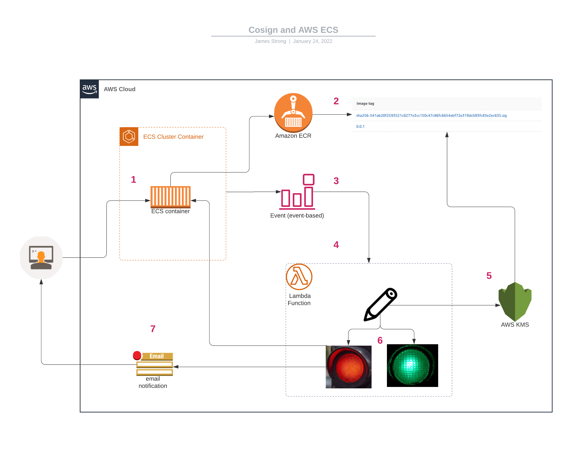

# cosign-ecs-verify

## How it works



1. Start an ECS task in the cluster
2. The task definition has the container image stored in ECR
3. EventBridge sends a notification to Lambda
4. Cluster and Task definition is sent to function 
5. KMS key that has signed an image 
6. Lambda function evaluates if container image is signed w/ KMS
7. If not signed with specified key it does two things
   1. Stop task definition and deregister the service (TODO: does it??)
   2. SNS notification email to alert that the service/task has been stopped

## Requirements

- TF
- AWS CLI and SAM CLI
- Go 1.17
- TODO: maybe jq?
- make
- docker
- cosign

## Steps

### cosign keypair

If you have a keypair for cosign, set it:

``` shell
export KEY_ALIAS=my-key
```


Otherwise we can make one:

1. make key_gen

### Deploy
- AWS SAM: the actual thingy
  - serverless function (source in cosign-ecs-function)
    - triggered on cloud watch event: ecs task/container state change
    - for each container in the event
      - get the key corresponding to the region
      - verify the container image 
    
1. make sam_deploy

### test

If you already have a signed images (ex. from previous blog), pass that in! TODO make sure you can do that

```shell
export IMAGE_URL_SIGNED=...
export IMAGE_URL_UNSIGNED=...
```

OTHERWISE, we'll make them
2. make sign
  - make verify
  

- Terraform: for demo purposes
  - ecs cluster
    - logs to cloudwatch log group
1. make tf_apply
   - make run_signed_task
   - make run_unsigned_task
   - verify status of each

### Cleanup

make sam_delete
make tf_destroy
  - also you need to kill the tasks first
clean up kms/docker if desired
